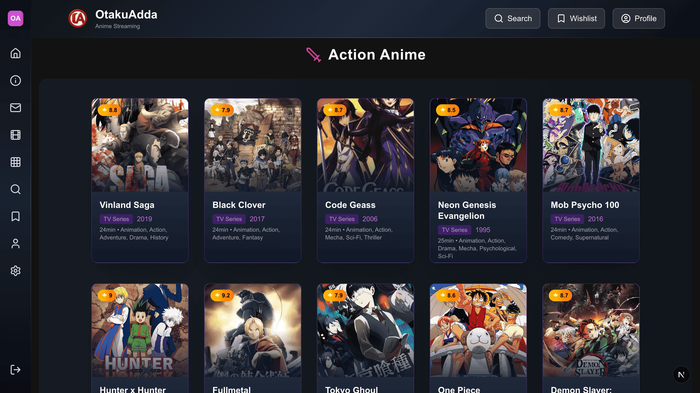

# OtakuAdda - (PreCollegeREPO)

> OtakuAdda is your one-stop hub for anime lovers!  
> Browse, search, and explore thousands of anime titles with sleek UI, smooth navigation, and personalized features like wishlist, subscriptions, and user profiles.  
> Built with Next.js + MongoDB, OtakuAdda brings the perfect blend of **speed, style, and otaku vibes** 🚀✨

<br/><br/>

<div align="center">
  
  
  [](https://nextjs.org/)
  [](https://reactjs.org/)
  [](https://nodejs.org/)
  [](https://www.mongodb.com/)
  [](https://www.postgresql.org/)
  [](https://tailwindcss.com/)

### _Discover your perfect anime experience. Explore our curated collection of genres and find your next favorite film._

</div>

---

## ✨ Features

### **Core Functionality**

- **Search**: Search anime, manga, and characters with filtering
- **HD Streaming**: High-quality video streaming
- **Personal Wishlist**: Save and organize your favorite anime collections
- **User Profiles**: Customizable profiles with avatar selection and preferences
- **Theme Support**: Dark/Light mode with seamless switching
- **Responsive Design**: Optimized for all devices - desktop, tablet, and mobile

### **User Experience**

- **Genre Categories**: Action, Adventure, Animation, Comedy, Crime, and many more
- **Rating System**: Demo ratings and reviews for Academic purpose
- **Fast Loading**: Optimized performance with Next.js and progressive loading
- **Interactive UI**: Smooth animations and modern design patterns

### **Subscription Model**

- **Monthly Plan**: $9.99/month - Perfect for casual viewers
- **Yearly Plan**: $71.88/year - Best value for otaku enthusiasts (Save 40%)
- **Premium Features**:
  - Unlimited anime streaming
  - HD & 4K quality
  - No ads interruption
  - Multiple devices support
  - Download for offline viewing
  - Exclusive early access
  - Premium anime collection
  - Priority customer support
  - Special member events

---

## 🛠️ Tech Stack

### **Frontend**

- **Framework**: Next.js 14 (React 18)
- **Styling**: Tailwind CSS
- **Icons**: Lucide React
- **Notifications**: React Toastify, SweetAlert2
- **Theme**: Next Themes
- **Loading**: NextJS TopLoader

### **Backend**

- **Runtime**: Node.js
- **API**: Next.js API Routes
- **Database**:
  - MongoDB (Anime metadata)
  - PostgreSQL (User data, subscriptions, wishlists)

### **Development Tools**

- **Language**: JavaScript
- **Package Manager**: npm
- **Version Control**: Git

---

## 📁 Project Structure

```
OTAKUADDA/
├── 📁 public/                    # Static assets
├── 📁 src/
│   ├── 📁 app/                   # Next.js App Router
│   │   ├── 📁 about/            # About page
│   │   ├── 📁 account/          # Authentication
│   │   │   ├── 📁 login/
│   │   │   └── 📁 signup/
│   │   ├── 📁 all-animes/       # Anime catalog page
│   │   ├── 📁 API/              # API endpoints
│   │   ├── 📁 categories/       # Genre categories
│   │   ├── 📁 components/       # Reusable components
│   │   │   ├── 📁 buttons/
│   │   │   ├── 📁 layout/
│   │   │   ├── 📁 notification/
│   │   │   ├── 📁 sections/
│   │   │   └── 📁 ui/
│   │   ├── 📁 contact/          # Contact page
│   │   ├── 📁 home/             # Homepage
│   │   ├── 📁 privacy-policies/ # Legal pages
│   │   ├── 📁 search/           # Search functionality page
│   │   ├── 📁 settings/         # User settings page
│   │   ├── 📁 subscriptions/    # Subscription plans page
│   │   ├── 📁 terms&conditions/ # Terms of service page
│   │   ├── 📁 user-profile/     # User profile page
│   │   ├── 📁 video/            # Particular anime page and Video Player
│   │   └── 📁 wishlist/         # User wishlist page
│   ├── 📁 lib/                  # Database connections
│   │   ├── mongodb.js
│   │   └── postgresqlPOOL.js
│   ├── 📁 models/               # Database models
│   └── 📁 RESOURCES/            # Developer resources & data types
├── 📁 SCREENSHOTS/              # Project screenshots
└── 📄 README.md
```

---

## 🚀 Quick Start

### Prerequisites

- Node.js 18+
- npm or yarn
- MongoDB instance
- PostgreSQL database

### Installation

1. **Clone the repository**

```bash
git clone https://github.com/Abhisek-Dash-Official/OtakuAdda-AnimeStreamingWeb.git
cd otakuadda
```

2. **Install dependencies**

```bash
npm install
npm install lucide-react
npm install sweetalert2
npm install react-toastify
npm install pg
npm install next-themes
npm install mongoose
npm install nextjs-toploader
```

3. **Environment Setup**
   Create a `.env.local` file in the root directory:

```env
NEXT_PUBLIC_IMG_URL=
PGUSER=yourusernamehere
PGHOST=localhost
PGDATABASE=otakuadda
PGPASSWORD=yourpasswordhere
PGPORT=5432

MONGODB_URI=mongodb://localhost:27017
DBNAME=otakuadda
```

4. **Start the development server**

```bash
npm run dev
```

Visit `http://localhost:3000` to see your application running! 🎉

---

# Screenshots

<div align="center">

## Home Page


<p><em>Home Page with slider</em></p>


<p><em>Home Page 2nd half</em></p>

<br/><br/>

## All animes page


<p><em>Explore all animes here</em></p>

<br/><br/>

## Category Page


<p><em>Anime categories beautifully displayed with icons</em></p>


<p><em>One of the category action-page</em></p>

<br/><br/>

## Item Page


<p><em>Detailed anime info page with description and stats</em></p>


<p><em>Anime info page 2nd part</em></p>


<p><em>Anime info page 3rd part</em></p>

<br/><br/>

## Redirecting


<p><em>Smooth redirect screen when user logs in</em></p>

<br/><br/>

## Loading


<p><em>Stylish loading while data fetching</em></p>

<br/><br/>

## Login Page


<p><em>Login screen with modern UI and validation</em></p>

<br/><br/>

## Sign Page


<p><em>Signup screen with smooth input animations</em></p>

<br/><br/>

## Navbar


<p><em>Navigation bar with dark/light mode and categories</em></p>

<br/><br/>

## Search Page


<p><em>Search functionality with instant results</em></p>

<br/><br/>

## Settings Page


<p><em>User settings page with customization options</em></p>

<br/><br/>

## Subscription Page


<p><em>Subscription page showing plans and offers</em></p>


<br/><br/>

## User Profile Page


<p><em>User profile page and management</em></p>

<br/><br/>

## Wishlist Page


<p><em>Wishlist page where users save their favorite anime</em></p>
</div>

---

## Key Features Showcase

### 🔐 **Authentication System**

- Secure login/signup with email validation
- Social login integration ready

### 🎬 **Content Management**

- Comprehensive anime database with detailed metadata
- Filtering and searching capabilities
- Real-time search

### 💳 **Subscription System**

- Flexible pricing plans with secure payment processing
- User subscription management
- Feature access control based on subscription tier

### 🎨 **Modern UI/UX**

- Smooth animations and transitions
- Accessible design following WCAG guidelines

---

## 🧪 Available Scripts

```bash
# Development
npm run dev          # Start development server
npm run build        # Build for production
npm run start        # Start production server
npm run lint         # Run ESLint
npm run test         # Run tests

---

### Development Workflow

1. Fork the repository
2. Create a feature branch (`git checkout -b feature/amazing-feature`)
3. Commit changes (`git commit -m 'Add amazing feature'`)
4. Push to branch (`git push origin feature/amazing-feature`)
5. Open a Pull Request


---

## 🙏 Acknowledgments

- **Anime Database**: Thanks to Google and other sources for providing comprehensive anime data.
- **Contributors**: Youtube tutorials and documentations

---

<div align="center">

**🌟 Star this repository if you find it helpful!**

---

**Made by [AbhisekDash](https://github.com/Abhisek-Dash-Official)**

_Join the Ultimate Anime Experience!_

</div>
```
